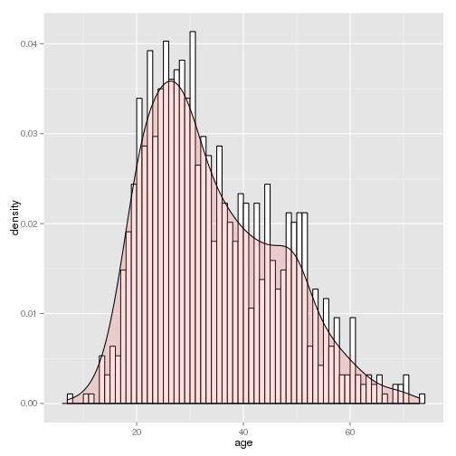
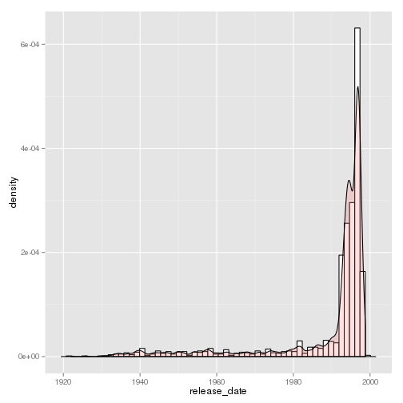
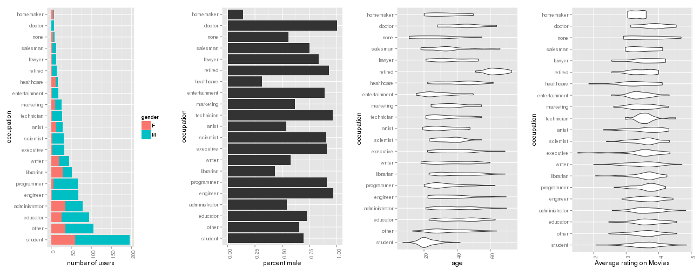
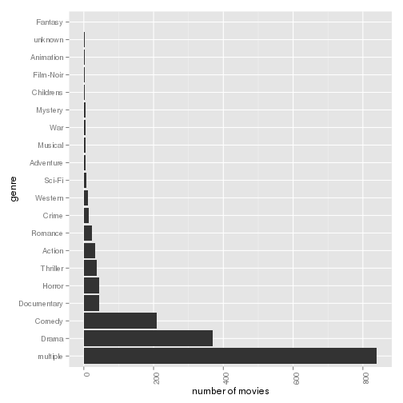
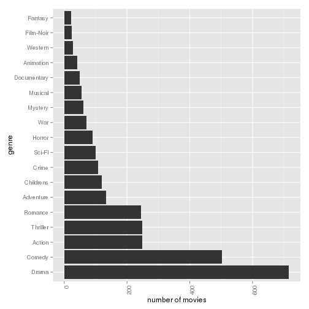
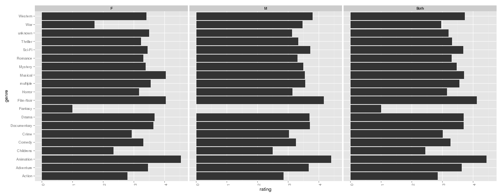
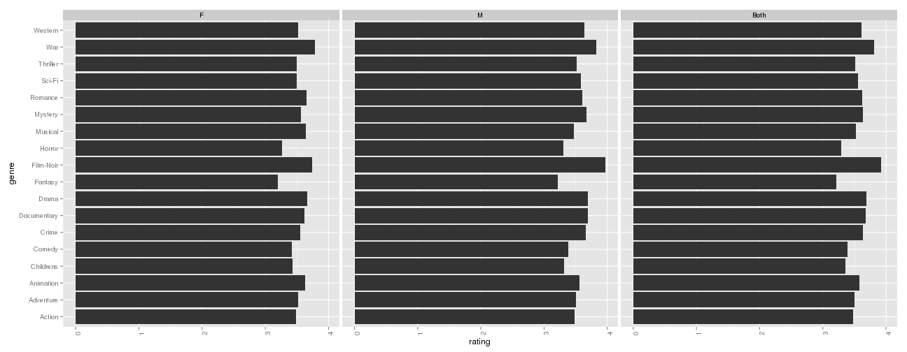
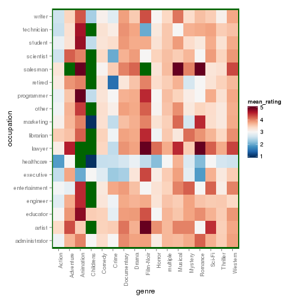

MovieLens Dataset Exploratory Analysis
========================================================
Author: Justin Chu
Purpose: The The code's purpose is three fold:

  *To explore the MovieLen dataset for trends with movie preferences.
  *To become better exploring data with R
  *To demonstrate an example statistical exploratory analysis project from raw data to report.

Notes: cleanMovieLensData.R must be run before this script to generate cleaned data that this script uses. It will generate 2 files:

* unifiedMLData.csv - has one genre per movie, will put "multiple" for multi-genre films
* unifiedMLDataMulti.csv - has multiple genre per movie. This mean that there are duplicate "user id" "movie name" combinations.

Start by loading libraries and data:

```r
# load requried libraries and data
library(ggplot2)
library(plyr)
library(RColorBrewer)
library(grid)

# load single genre file
mlDat <- read.csv("Results/unifiedMLData.csv")
# fix dates field
mlDat$release_date <- as.Date(mlDat$release_date, "%Y-%m-%d")
# sanity checking
str(mlDat)
summary(mlDat)
head(mlDat)
tail(mlDat)

# load multi genre file
mlDat_multi <- read.csv("Results/unifiedMLDataMulti.csv")
# fix dates field
mlDat_multi$release_date <- as.Date(mlDat_multi$release_date, "%Y-%m-%d")
# sanity checking
str(mlDat_multi)
summary(mlDat_multi)
head(mlDat_multi)
tail(mlDat_multi)
```


## Investigate general dataset features

Let see what the ages for the users are like in our data:


```r
# prepare table for analysis of users
mlDat_user <- ddply(mlDat, ~user_id + age + gender + occupation, summarize, 
    mean_rating = mean(rating))
agePlot <- ggplot(mlDat_user, aes(age)) + geom_histogram(aes(y = ..density..), 
    binwidth = 1, colour = "black", fill = "white")
agePlot <- agePlot + geom_density(alpha = 0.2, fill = "#FF6666")
print(agePlot)
```

 

```r
ggsave(filename = "agePlot.pdf")
```

```
## Saving 7 x 7 in image
```

Users tend to be mostly in the late teens and mid thirties, though there seems to be another peak the occurs in the late forties.

Let see what the release dates are like for the movies in our data:


```r
# prepare table for analysis of movies
mlDat_movie <- ddply(mlDat, ~movie_title + release_date + genre, summarize, 
    mean_rating = mean(rating))
datesPlot <- ggplot(mlDat_movie, aes(release_date)) + geom_histogram(aes(y = ..density..), 
    binwidth = 500, colour = "black", fill = "white")
# alter axis
datesPlot <- datesPlot + geom_density(alpha = 0.2, fill = "#FF6666")
print(datesPlot)
```

```
## Warning: Removed 1 rows containing non-finite values (stat_density).
```

 

```r
ggsave(filename = "datesPlot.pdf")
```

```
## Saving 7 x 7 in image
```

```
## Warning: Removed 1 rows containing non-finite values (stat_density).
```

Most movies in the data tend to be from the 1990's. There is a pretty long tale meaning they have at least some moves from the past.

## Investigate the users with respect to profession that contributed to the dataset

Lets get a feel of the dataset with respect to the profession within the dataset. Lets look at:

* Total numbers of each profession that contributed to the dataset
* Gender bias in each profession
* How old each profession tends to be
* How the professions tend to rank movies


```r
# sorts by number of users
userPlot <- ggplot(mlDat_user, aes(x = reorder(occupation, occupation, function(x) -length(x)), 
    fill = gender)) + geom_bar()
# fix axis
userPlot <- userPlot + theme(axis.text.x = element_text(angle = 90, hjust = 1))
userPlot <- userPlot + ylab("number of users") + xlab("occupation")
# flip axis to make professions easier to read
userPlot <- userPlot + coord_flip()

ggsave(filename = "userPlot.pdf")
```

```
## Saving 18 x 7 in image
```

```r

gender_dat <- ddply(mlDat_user, ~occupation, summarize, perc_male = (length(gender[gender == 
    "M"])/length(gender)), counts = -length(user_id))

# sorts by number of users
genderPlot <- ggplot(gender_dat, aes(x = reorder(occupation, counts), perc_male)) + 
    geom_bar(stat = "identity")
# fix axis
genderPlot <- genderPlot + theme(axis.text.x = element_text(angle = 90, hjust = 1))
genderPlot <- genderPlot + ylab("percent male") + xlab("occupation")
# flip axis to make professions easier to read
genderPlot <- genderPlot + coord_flip()

ggsave(filename = "genderPlot.pdf")
```

```
## Saving 18 x 7 in image
```

```r

agePlot <- ggplot(mlDat_user, aes(x = reorder(occupation, occupation, function(x) -length(x)), 
    age)) + geom_violin()
# fix axis
agePlot <- agePlot + theme(axis.text.x = element_text(angle = 90, hjust = 1))
agePlot <- agePlot + ylab("age") + xlab("occupation")
# flip axis to make professions easier to read
agePlot <- agePlot + coord_flip()

# for plotting for age information
agePlot <- ggplot(mlDat_user, aes(x = reorder(occupation, occupation, function(x) -length(x)), 
    age)) + geom_violin()
# fix axis
agePlot <- agePlot + theme(axis.text.x = element_text(angle = 90, hjust = 1))
agePlot <- agePlot + ylab("age") + xlab("occupation")
# flip axis to make professions easier to read
agePlot <- agePlot + coord_flip()

ggsave(filename = "agePlot.pdf")
```

```
## Saving 18 x 7 in image
```

```r

# for plotting rating trends
rankPlot <- ggplot(mlDat_user, aes(x = reorder(occupation, occupation, function(x) -length(x)), 
    mean_rating)) + geom_violin()
# fix axis
rankPlot <- rankPlot + theme(axis.text.x = element_text(angle = 90, hjust = 1))
rankPlot <- rankPlot + ylab("Average rating on Movies") + xlab("occupation")
# flip axis to make professions easier to read
rankPlot <- rankPlot + coord_flip()

ggsave(filename = "rankPlot.pdf")
```

```
## Saving 18 x 7 in image
```

```r

# for printing figures adjacent to eachother
vplayout <- function(x, y) viewport(layout.pos.row = x, layout.pos.col = y)
grid.newpage()
pushViewport(viewport(layout = grid.layout(1, 4)))
print(userPlot, vp = vplayout(1, 1))
print(genderPlot, vp = vplayout(1, 2))
print(agePlot, vp = vplayout(1, 3))
print(rankPlot, vp = vplayout(1, 4))
```

 


Observations:

* There are very few doctors and homemakers, we probably can't say anything about these groups with very much confidence
* Students have a very low average age in contrast to the retired. Although these stand out the most, the rest have some divergence; for example average programmer is younger then the average healthcare worker.
* Males make up of more of our sample. Some professions like engineering (rather unsurprisingly) are completely male dominated.
* The professions do not rank things evenly. Some appear more picky; for example executives seem to sometime rank movies very low and healthcare workers seem to have a very low average rating.

## Investigate the movies with respect to users in the dataset

#### Total number of movies with a specific genre counted single times:


```r
genreCountPlot <- ggplot(mlDat_movie, aes(x = reorder(genre, genre, function(x) -length(x)))) + 
    geom_bar()
# fix axis
genreCountPlot <- genreCountPlot + theme(axis.text.x = element_text(angle = 90, 
    hjust = 1))
genreCountPlot <- genreCountPlot + ylab("number of movies") + xlab("genre")
genreCountPlot <- genreCountPlot + coord_flip()
print(genreCountPlot)
```

 

```r
ggsave(filename = "genreCountPlot.pdf")
```

```
## Saving 7 x 7 in image
```

A majority of the titles are multi genre. There really does not seem to be an even spread of titles, for example there are almost no pure fantasy titles.

#### Total number of movies with a specific genre counted multiple times for multi genre movies:

```r
mlDat_movie_multi <- ddply(mlDat_multi, ~movie_title + release_date + genre, 
    summarize, mean_rating = mean(rating))

genreCountPlot_multi <- ggplot(mlDat_movie_multi, aes(x = reorder(genre, genre, 
    function(x) -length(x)))) + geom_bar()
# fix axis
genreCountPlot_multi <- genreCountPlot_multi + theme(axis.text.x = element_text(angle = 90, 
    hjust = 1))
genreCountPlot_multi <- genreCountPlot_multi + ylab("number of movies") + xlab("genre")
genreCountPlot_multi <- genreCountPlot_multi + coord_flip()
print(genreCountPlot_multi)
```

 

```r
ggsave(filename = "genreCountPlot_multi.pdf")
```

```
## Saving 7 x 7 in image
```

It is better to think of the number of movies as proportion rather than a total since some titles contribute multiple times to the count. It is worth noting that documentries no longer seem to be a high count genre (as opposed to the previous plot). This is of course because movies that are documentries typically do not have other genre associated with them.

## Investigate the trends in movies with respect to rating and other factors within the dataset

#### Does genre affect the rating of a movie? Does genre matter to the average male or female?

Pure genres:

```r
mlDat_avgRating <- ddply(mlDat, ~genre, summarize, gender = "Both", rating = mean(rating))
mlDat_gender <- ddply(mlDat, ~genre + gender, summarize, rating = mean(rating))
mlDat_gender <- rbind(mlDat_gender, mlDat_avgRating)

genderRatingPlot <- ggplot(mlDat_gender, aes(genre, rating)) + geom_histogram(stat = "identity")
genderRatingPlot <- genderRatingPlot + facet_wrap(~gender)
# fix axis
genderRatingPlot <- genderRatingPlot + theme(axis.text.x = element_text(angle = 90, 
    hjust = 1))
genderRatingPlot <- genderRatingPlot + coord_flip()
print(genderRatingPlot)
```

 

```r
ggsave(filename = "genderRatingPlot.pdf")
```

```
## Saving 18 x 7 in image
```

Noir and Animation seem to be the highest rated surprisingly. Low sample sizes for some of these is a problem; the only reason fantasy and war seem like they make a difference in terms of gender is that the sample size for both is quite small. The only gender differnce I notice is maybe the fact that women seem to like musicals more than men.

multiple genres:

```r
mlDat_avgRating <- ddply(mlDat_multi, ~genre, summarize, gender = "Both", rating = mean(rating))
mlDat_gender <- ddply(mlDat_multi, ~genre + gender, summarize, rating = mean(rating))
mlDat_gender <- rbind(mlDat_gender, mlDat_avgRating)

genderRatingPlot <- ggplot(mlDat_gender, aes(genre, rating)) + geom_histogram(stat = "identity")
genderRatingPlot <- genderRatingPlot + facet_wrap(~gender)
# fix axis
genderRatingPlot <- genderRatingPlot + theme(axis.text.x = element_text(angle = 90, 
    hjust = 1))
genderRatingPlot <- genderRatingPlot + coord_flip()
print(genderRatingPlot)
```

 

```r
ggsave(filename = "genderRatingPlot_multi.pdf")
```

```
## Saving 18 x 7 in image
```

The low sample sizes seem to be fixed. Things I notice:

* Horror movies do not get good ratings. It fits my expectations since horror movies tend to typically focused on cheap thrills but are not typically impactful.
* There are very few fantasy films and they tend to rank low. It could be that no one wants to take risks on making these types of movies because of this.
*

## Investigate trends in profession with respect to movie genre preference

Below is a code to generate heatmap with genre and profession as the x and y axes. For simplicity I used the genre column I created in my previous script that merged multiple genres into the variable "multiple"). I removed elements that did not have very observations (based on figure above).

This is my first pass attempt:

```r
# prepare data for heatmap
mlDat_genre_occup <- ddply(mlDat, ~genre + occupation, summarize, mean_rating = mean(rating))

mlDat_genre_occup <- droplevels(subset(mlDat_genre_occup, occupation != "homemaker"))
mlDat_genre_occup <- droplevels(subset(mlDat_genre_occup, genre != "unknown"))
mlDat_genre_occup <- droplevels(subset(mlDat_genre_occup, genre != "Fantasy"))
mlDat_genre_occup <- droplevels(subset(mlDat_genre_occup, occupation != "none"))
mlDat_genre_occup <- droplevels(subset(mlDat_genre_occup, genre != "War"))
mlDat_genre_occup <- droplevels(subset(mlDat_genre_occup, occupation != "doctor"))

# choose divergent colour tones to try and make distintions between like and
# dislike
heatMapPalette <- colorRampPalette(rev(brewer.pal(11, "RdBu")))

# get data ready for heatmap
goHeat <- ggplot(mlDat_genre_occup, aes(x = genre, y = occupation, fill = mean_rating))
# rotate labels
goHeat <- goHeat + geom_tile() + theme(axis.text.x = element_text(angle = 90, 
    hjust = 1))
# add colours
goHeat <- goHeat + scale_fill_gradientn(colours = heatMapPalette(100))
# change background
goHeat <- goHeat + theme(panel.background = element_rect(fill = "darkgreen"), 
    panel.grid.major = element_blank(), panel.grid.minor = element_blank())
print(goHeat)
```

 

```r
ggsave(filename = "genreOccupHeatMap.pdf")
```

```
## Saving 7 x 7 in image
```

Note: Green tiles are missing data.

So now I'm noticing some other interesting trends:

* The retired (and likely elderly) do not like pure crime movies. Maybe they prefer not to think about what crimes could happen.
* People who work in healthcare (not doctors) have extremely high standards.
* Executives tend to dislike many movie genres but still like noir films.
* Lawyers like noir and romance films.
* Many more - do you see anything interesting?

Caveats: I can't say how confident I am about these trends. Some professions are underrepresented (for instance there are only 7 doctors in this dataset who also happen to be male). Also, Pooling together multiple genre movies greatly reduced possible the sample sizes for genres. Finally, the division point (white colour) is placed on roughly a rating of 3 but people tend to rank movies more than 3 on average.

#### My attempt to remedy problems with previous heatmap:

Below is a code to generate heatmap with genre and profession as the x and y axes. I used all movies in analysis including multiple genre films (they will count towards more than on category).

This is my second attempt pass attempt:

```r
# prepare data for heatmap
mlDat_genre_occup <- ddply(mlDat_multi, ~genre + occupation, summarize, mean_rating = mean(rating))

# choose divergent colour tones to try and make distintions between like and
# dislike
heatMapPalette <- colorRampPalette(rev(brewer.pal(11, "RdBu")))

# get data ready for heatmap
goHeat2 <- ggplot(mlDat_genre_occup, aes(x = genre, y = occupation, fill = mean_rating))
# rotate labels
goHeat2 <- goHeat2 + geom_tile() + theme(axis.text.x = element_text(angle = 90, 
    hjust = 1))
# add colours
goHeat2 <- goHeat2 + scale_fill_gradientn(limits = c(2.5, 4.6), colours = heatMapPalette(100))
# change background
goHeat2 <- goHeat2 + theme(panel.background = element_rect(fill = "darkgreen"), 
    panel.grid.major = element_blank(), panel.grid.minor = element_blank())
print(goHeat2)
```

 

```r
ggsave(filename = "genreOccupHeatMap_multi.pdf")
```

```
## Saving 7 x 7 in image
```

Note: Green tiles are missing data.

Less missing data! Some of the same trends are there but everything appears smoothed out. It is harder to draw conclusions from this heatmap. I think I need some way of making repeated genre movies contribute proportionally rather than cumulatively.

### Testing out emdedding images

Testing out emdedding of image:


### Acknowledgements:

* Jenny Bryan and Song Cai - for their help, teaching, and providing good resources for learning R
* Weicong Liao - for posting/alerting the class to this dataset to begin with
* grouplens.org/datasets/movielens/ - for posting there raw data publically for people to analyze
